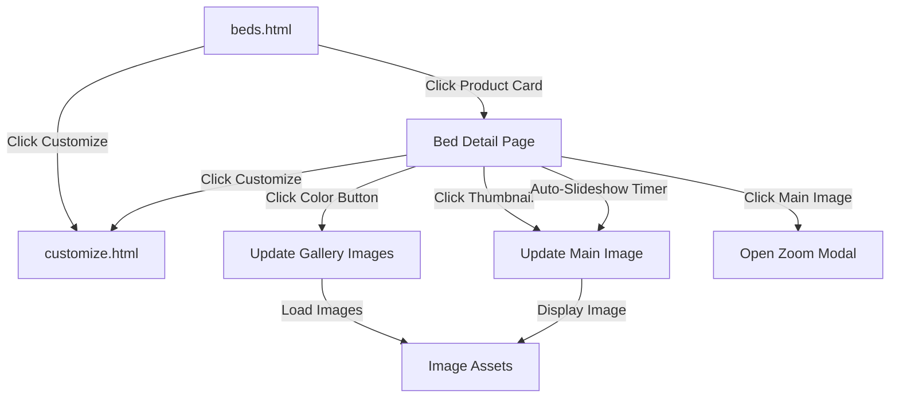

# Design Document: Beds Gallery and Detail Pages

## Overview

This design implements a complete bed product gallery and detail page system for the Forever Finds Furniture e-commerce website. The implementation follows the established patterns from the existing couch pages, ensuring consistency in user experience, code structure, and visual design.

The feature consists of two main components:
1. **Gallery Enhancement**: Populating beds.html with actual product images and proper navigation
2. **Detail Pages**: Creating four individual bed product detail pages with interactive galleries, color selection, auto-slideshow, and zoom functionality

The design leverages existing CSS classes, JavaScript patterns, and HTML structures to minimize code duplication while maintaining the luxury brand aesthetic.

## Architecture

### Component Structure

```
beds-gallery-and-detail-pages/
├── beds.html (existing - to be enhanced)
└── products/
    ├── queen-upholstered-bed.html (new)
    ├── king-statement-bed.html (new)
    ├── luxury-frame-6x6.html (new)
    └── modern-bed-5x6.html (new)
```

### Data Flow



### Technology Stack

- **HTML5**: Semantic markup following existing patterns
- **CSS3**: Existing main.css with luxury theme variables
- **Vanilla JavaScript**: Inline scripts for gallery functionality (no frameworks)
- **Image Assets**: Product images organized by product and color variant

## Components and Interfaces

### 1. Beds Gallery Page (beds.html)

**Purpose**: Display all bed products in a grid layout with images and navigation

**Structure**:
```html
<section class="section fade-in">
  <div class="container products-grid">
    <div class="product-card">
      <a href="products/[product-name].html">
        <div class="product-img">
          
        </div>
      </a>
      <h4>[Product Name]</h4>
      <div class="product-actions">
        <a href="products/[product-name].html" class="text-link">View Details</a>
        <a href="customize.html?product=[Product Name]" class="btn-outline">Customize</a>
      </div>
    </div>
    <!-- Repeat for each product -->
  </div>
</section>
```

**CSS Classes Used**:
- `.products-grid`: 4-column grid layout (responsive)
- `.product-card`: Card container with hover effects
- `.product-img`: Image container with fixed height (220px)
- `.product-actions`: Flex container for action buttons
- `.text-link`: Gold link with arrow
- `.btn-outline`: Gold outlined button

**Image Selection Strategy**:
Since the Bed-galary folder is empty, we'll use images from the signature-pieces folder:
- Queen Size Upholstered Bed → luxury-panel-bed/1.jpg
- King Size Statement Bed → wing-bed/1.jpg
- 6x6 Luxury Frame → modern-curved/1.jpg
- 5x6 Modern Bed → sculpted-minimal/1.jpg

### 2. Bed Detail Page Component

**Purpose**: Display detailed product information with interactive gallery

**HTML Structure**:
```html
<main class="section">
  <div class="container product-layout">
    <!-- LEFT: GALLERY -->
    <div class="gallery">
      <!-- Color Selector -->
      <div class="color-selector">
        <span class="color-label">Select Color:</span>
        <div class="color-options">
          <button class="color-btn active" data-color="[color]" style="background:[hex];"></button>
          <!-- More color buttons -->
        </div>
      </div>
      
      <!-- Main Image -->
      <div class="main-image" id="zoomTrigger">
        
      </div>
      
      <!-- Vertical Thumbnails -->
      <div class="thumbs-vertical" id="thumbnailContainer"></div>
    </div>
    
    <!-- RIGHT: PRODUCT INFO -->
    <div class="product-info">
      <h1>[Product Name]</h1>
      <p class="product-description">[Description]</p>
      <a href="../customize.html?product=[Product Name]" class="btn-primary">
        Customize This Design
      </a>
    </div>
  </div>
</main>

<!-- Fullscreen Modal -->
<div class="image-modal" id="imageModal">
  <span class="close-modal">&times;</span>
  
</div>
```

**CSS Classes Used**:
- `.product-layout`: 2-column grid (1.2fr 1fr)
- `.gallery`: Gallery container
- `.color-selector`: Color picker component
- `.color-btn`: Circular color button (32px × 32px)
- `.main-image`: Main image container (450-750px height)
- `.thumbs-vertical`: Vertical thumbnail strip
- `.thumb`: Individual thumbnail (90px × 90px)
- `.image-modal`: Fullscreen overlay
- `.product-info`: Right column content

### 3. Color Selector Component

**Purpose**: Allow users to switch between color variants

**Interface**:
```javascript
// Color button structure
<button class="color-btn [active]" 
        data-color="[color-name]" 
        style="background:[hex-color];">
</button>
```

**Behavior**:
- Clicking a color button triggers `loadGallery(color)` function
- Active color has `.active` class with gold border and glow
- Color data stored in `data-color` attribute
- Visual color displayed via inline `background` style

**Color Options** (to be used across all bed products):
- Black: `#111`
- Olive Green: `#21c251`
- Off-White: `#f5f5f5`
- Burnt Orange: `#c45a2c`
- Gray: `#808080`

### 4. Image Gallery Component

**Purpose**: Display and navigate product images

**State Management**:
```javascript
let currentColor = "black";        // Currently selected color
const totalImages = 4;             // Number of images per color
let autoSlideIndex = 0;            // Current slide index
let autoSlideInterval;             // Interval timer reference
```

**Core Functions**:

**loadGallery(color)**:
- Clears existing thumbnails
- Generates thumbnails for all images in the color directory
- Sets first image as active
- Initializes auto-slideshow
- Updates main image source

**Thumbnail Click Handler**:
- Removes `.active` class from all thumbnails
- Adds `.active` class to clicked thumbnail
- Fades out main image (opacity: 0)
- Updates main image source after 200ms delay
- Fades in main image (opacity: 1)
- Resets auto-slideshow index

**Image Path Pattern**:
```
../assets/images/beds/[product-name]/[color]/[1-4].jpg
```

### 5. Auto-Slideshow Component

**Purpose**: Automatically cycle through product images

**Implementation**:
```javascript
function startAutoSlide() {
  clearInterval(autoSlideInterval);
  
  autoSlideInterval = setInterval(() => {
    const thumbs = document.querySelectorAll(".thumb");
    autoSlideIndex = (autoSlideIndex + 1) % thumbs.length;
    thumbs[autoSlideIndex].click();
  }, 4000);
}
```

**Pause/Resume Logic**:
- **Pause**: `mouseenter` event on main image clears interval
- **Resume**: `mouseleave` event on main image restarts slideshow
- **Reset**: Manual thumbnail click updates `autoSlideIndex` and continues

**Timing**: 4000ms (4 seconds) per image

### 6. Zoom Modal Component

**Purpose**: Display fullscreen enlarged images

**Trigger Events**:
- Click on main image opens modal
- Click on close button (×) closes modal
- Click outside image (on modal background) closes modal

**Implementation**:
```javascript
// Open modal
mainImage.addEventListener("click", () => {
  modal.style.display = "flex";
  modalImg.src = mainImage.src;
});

// Close modal
closeModal.addEventListener("click", () => {
  modal.style.display = "none";
});

modal.addEventListener("click", (e) => {
  if (e.target === modal) {
    modal.style.display = "none";
  }
});
```

**Styling**:
- Fixed position overlay covering entire viewport
- `rgba(0,0,0,0.95)` background
- Flexbox centering
- Image max-width: 90%, max-height: 90%
- Close button: 40px font size, positioned top-right

## Data Models

### Product Data Structure

Each bed product has the following attributes:

```javascript
{
  name: "Queen Size Upholstered Bed",
  slug: "queen-upholstered-bed",
  description: "Elegant upholstered bed with premium fabric and modern design.",
  colors: ["black", "olive-green", "off-white", "burnt-orange", "gray"],
  imagesPerColor: 4,
  imagePath: "../assets/images/beds/queen-upholstered-bed/",
  defaultColor: "black"
}
```

### Product List

1. **Queen Size Upholstered Bed**
   - Slug: `queen-upholstered-bed`
   - Description: "Elegant upholstered bed with premium fabric and modern design, perfect for sophisticated bedrooms."

2. **King Size Statement Bed**
   - Slug: `king-statement-bed`
   - Description: "Bold statement piece with luxurious upholstery and commanding presence for master suites."

3. **6x6 Luxury Frame**
   - Slug: `luxury-frame-6x6`
   - Description: "Spacious luxury bed frame with clean lines and premium construction for ultimate comfort."

4. **5x6 Modern Bed**
   - Slug: `modern-bed-5x6`
   - Description: "Contemporary bed design with minimalist aesthetic and exceptional craftsmanship."

### Image Asset Organization

**Current State**: Bed-galary folder is empty

**Solution**: Use placeholder images from signature-pieces folder for gallery, and create a note that actual bed product images should be added to:
```
assets/images/beds/
├── queen-upholstered-bed/
│   ├── black/
│   │   ├── 1.jpg
│   │   ├── 2.jpg
│   │   ├── 3.jpg
│   │   └── 4.jpg
│   ├── olive-green/
│   ├── off-white/
│   ├── burnt-orange/
│   └── gray/
├── king-statement-bed/
├── luxury-frame-6x6/
└── modern-bed-5x6/
```

**Fallback Strategy**: If color-specific images don't exist, use the same image set for all colors (graceful degradation)

### URL Parameter Structure

**Gallery to Detail**:
```
products/queen-upholstered-bed.html
```

**Detail to Customize**:
```
customize.html?product=Queen%20Size%20Upholstered%20Bed
```

The existing `main.js` handles URL parameter parsing and pre-filling the customize form.


## Correctness Properties

A property is a characteristic or behavior that should hold true across all valid executions of a system—essentially, a formal statement about what the system should do. Properties serve as the bridge between human-readable specifications and machine-verifiable correctness guarantees.

### Property 1: Color Selection Updates Gallery

*For any* color button on a bed detail page, when that color button is clicked, all gallery images (main image and thumbnails) should update to display images from that color's directory.

**Validates: Requirements 3.2, 3.4**

### Property 2: Active Color Visual Indication

*For any* color selection state, exactly one color button should have the `.active` class with gold border styling.

**Validates: Requirements 3.3**

### Property 3: Thumbnail Click Updates Main Image

*For any* thumbnail in the gallery, when clicked, the main image source should update to match that thumbnail's image source.

**Validates: Requirements 4.3**

### Property 4: Active Thumbnail Visual Indication

*For any* gallery state, exactly one thumbnail should have the `.active` class with gold border styling.

**Validates: Requirements 4.4**

### Property 5: Manual Selection Preserves Slideshow

*For any* manually selected image in the gallery, the auto-slideshow should continue cycling from that image after the manual selection.

**Validates: Requirements 5.2**

### Property 6: Slideshow Sequential Cycling

*For any* sequence of auto-slideshow advances, the images should cycle in sequential order (0, 1, 2, ..., n-1, 0, 1, ...) and loop back to the first image.

**Validates: Requirements 5.5**

### Property 7: Modal Displays Current Image

*For any* state where the zoom modal is opened, the modal image source should match the currently displayed main image source.

**Validates: Requirements 6.5**

## Error Handling

### Missing Image Assets

**Scenario**: Referenced image file does not exist

**Handling**:
- Browser will display broken image icon
- Console will log 404 error
- Gallery will continue to function with remaining images

**Prevention**:
- Validate image paths during development
- Use fallback images from signature-pieces folder
- Document required image structure in README

### JavaScript Errors

**Scenario**: Gallery script fails to initialize

**Handling**:
- Page will still display static content
- Color selector and thumbnails will be visible but non-functional
- Customize button will remain functional

**Prevention**:
- Wrap gallery initialization in try-catch blocks
- Check for element existence before adding event listeners
- Use defensive programming for DOM queries

### Missing DOM Elements

**Scenario**: Required elements (thumbnailContainer, currentImage, etc.) not found

**Handling**:
- Gallery functions will exit early if elements are null
- Console warnings for missing elements
- Page remains functional for non-gallery features

**Prevention**:
```javascript
const mainImage = document.getElementById("currentImage");
if (!mainImage) {
  console.warn("Main image element not found");
  return;
}
```

### Color Directory Missing

**Scenario**: Selected color directory has no images

**Handling**:
- Gallery will display empty thumbnails
- Main image will show broken image
- User can select different color

**Mitigation**:
- Use same image set for all colors as fallback
- Validate color directories exist before deployment

### Auto-Slideshow Memory Leaks

**Scenario**: Multiple intervals running simultaneously

**Handling**:
- Always call `clearInterval()` before setting new interval
- Clear interval on page unload

**Prevention**:
```javascript
function startAutoSlide() {
  clearInterval(autoSlideInterval); // Clear existing first
  autoSlideInterval = setInterval(() => {
    // slideshow logic
  }, 4000);
}
```

### Modal Not Closing

**Scenario**: Modal remains open due to event handler failure

**Handling**:
- Multiple close mechanisms (close button, backdrop click, ESC key)
- Modal can be closed by refreshing page

**Prevention**:
- Add ESC key listener for modal close
- Ensure event listeners are properly attached

## Testing Strategy

This feature requires a dual testing approach combining unit tests for specific scenarios and property-based tests for universal behaviors.

### Unit Testing

Unit tests will focus on specific examples, edge cases, and integration points:

**Gallery Page Tests**:
- Verify all four product cards render with images
- Verify "View Details" links point to correct detail pages
- Verify "Customize" buttons have correct URL parameters
- Test responsive grid layout at different breakpoints

**Detail Page Tests**:
- Verify page title matches product name
- Verify product description is present
- Verify customize button links to correct URL
- Test initial gallery load with default color
- Test modal open/close with specific interactions
- Test auto-slideshow timing (4-second intervals)
- Test hover pause/resume behavior
- Test responsive layout transformations

**Integration Tests**:
- Test navigation from gallery to detail page
- Test navigation from detail page to customize page
- Test customize page pre-fills product name correctly
- Test header/footer partials load correctly

**Edge Cases**:
- Empty thumbnail container
- Missing image files (404 handling)
- Single image in gallery
- No color variants available
- Modal with very large images

### Property-Based Testing

Property tests will verify universal behaviors across all inputs using a JavaScript property-based testing library (fast-check):

**Configuration**:
- Minimum 100 iterations per property test
- Each test tagged with feature name and property number
- Tests run as part of standard test suite

**Property Test Implementation**:

Each correctness property will be implemented as a property-based test:

**Property 1 Test**: Generate random color selections, verify all gallery images update to that color's directory

**Property 2 Test**: Generate random color selection sequences, verify exactly one color button has `.active` class

**Property 3 Test**: Generate random thumbnail clicks, verify main image source matches clicked thumbnail

**Property 4 Test**: Generate random gallery states, verify exactly one thumbnail has `.active` class

**Property 5 Test**: Generate random manual selections during slideshow, verify slideshow continues from selected image

**Property 6 Test**: Generate random slideshow sequences, verify cycling order is sequential and loops correctly

**Property 7 Test**: Generate random modal open events, verify modal image matches main image

**Test Tag Format**:
```javascript
// Feature: beds-gallery-and-detail-pages, Property 1: Color Selection Updates Gallery
test('color selection updates all gallery images', () => {
  fc.assert(
    fc.property(fc.constantFrom('black', 'olive-green', 'off-white', 'burnt-orange', 'gray'), (color) => {
      // Test implementation
    })
  );
});
```

### Testing Tools

- **Unit Tests**: Jest or Mocha with JSDOM for DOM manipulation
- **Property Tests**: fast-check for JavaScript property-based testing
- **E2E Tests**: Playwright or Cypress for full user flow testing
- **Visual Tests**: Percy or Chromatic for visual regression testing (optional)

### Test Coverage Goals

- 90%+ code coverage for gallery JavaScript
- 100% coverage of error handling paths
- All 7 correctness properties implemented as property tests
- All edge cases covered by unit tests
- All user flows covered by integration tests

### Continuous Integration

- Run all tests on every commit
- Block merges if tests fail
- Generate coverage reports
- Run visual regression tests on staging deployments
